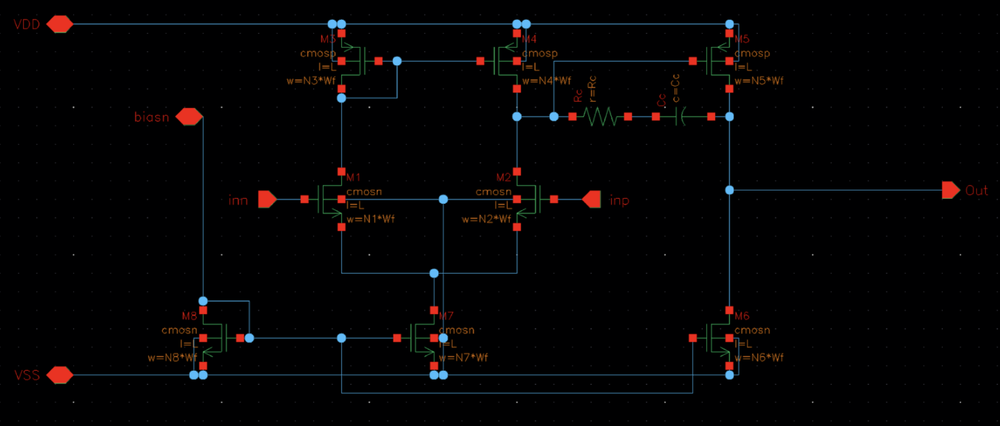

# CMOS Feedback Operational Transconductance Amplifier
## Arif Amzad

## About
This project covers the design of an Operation Transconductance Amplifier (OTA) to be used as a feedback amplifier to drive an oscilloscope input. The OTA was specified to have a maximum IDD current of 700uA, a gain of 4V/V, and a loading of a 1MΩ resistor in parallel with a 20pF capacitor. The OTA used a symmetric +1.25/-1.25V supply along with a ideal 10uA current reference. The OTA needed a high enough input impedance to be able to accurately measure DC voltages to 0.1% and be able to have a fast step response such that the overshoot is less than 1%. In addition, all transistors needed an overdrive voltage above 200mV.

Operating Point, DC, AC, and Transient simulations were used extensively throughout the design process using a TSMC 0.25um model library in Cadence Virtuoso. Process Voltage Temperature variations were simulated as well to determine how the behavior of the OTA changes under conditional changes.

## Schematic

## Datasheet

|              | Parameter                                    | Simulation  (nom. cond.) | Units      |
|--------------|----------------------------------------------|:------------------------:|-------|
| Requirements | Max. Supply Current IDDmax [uA]              |                      700 | μA    |
|              | Gain G [V/V]                                 |                        4 | V/V   |
| DC           | Current Consumption                          |                    694.1 | μA    |
| AC           | Loop Gain                                    |                    66.90 | dB    |
|              | Phase Margin                                 |                     78.6 | deg   |
|              | Unity-Gain Frequency Loop Gain               |                     3.71 | MHz   |
|              | Closed-Loop Gain                             |                    12.04 | dB    |
|              | Closed-Loop 3-dB Bandwidth                   |                     5.85 | MHz   |
| DC           | DC Output Offset                             |                   -0.712 | mV    |
|              | Input-Referred DC Offset                     |                    0.178 | mV    |
|              | Input Operation Range Vin,min                |                     -270 | mV    |
|              | Input Operation Range Vin,max                |                      260 | mV    |
|              | DC Accuracy @ +1mV Input                     |                   99.96% | %     |
|              | DC Accuracy @ -1mV Input                     |                   99.96% | %     |
|              | DC Accuracy @ Vin,max                        |                   99.90% | %     |
|              | DC Accuracy @ Vin,min                        |                   99.91% | %     |
| Transient    | Settling Time to 1% Accuracy @ 1mV Step      |                     0.10 | μs    |
|              | Overshoot @ 1mV Step                         |                    0.32% | %     |
|              | Settling Time to 1% Accuracy @ -1mV Step     |                     0.10 | μs    |
|              | Overshoot @ -1mV Step                        |                    0.25% | %     |
|              | Settling Time to 1% Accuracy @ 100mV/G Step  |                     0.11 | μs    |
|              | Overshoot @ 100mV/G Step                     |                    0.11% | %     |
|              | Settling Time to 1% Accuracy @ -100mV/G Step |                     0.11 | μs    |
|              | Overshoot @ -100mV/G Step                    |                    0.10% | %     |
|              | Settling Time to 1% Accuracy @ Max Step      |                     0.12 | μs    |
|              | Overshoot @ Max Step                         |                       0% | %     |
|              | Settling Time to 1% Accuracy @ Min Step      |                     0.10 | μs    |
|              | Overshoot @ Min Step                         |                    0.09% | %     |
| Noise        | Estimated Integrated Noise Power [uV]        |                     14.9 | μVRMS |
